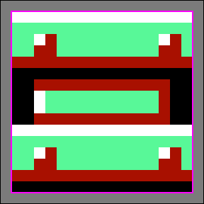
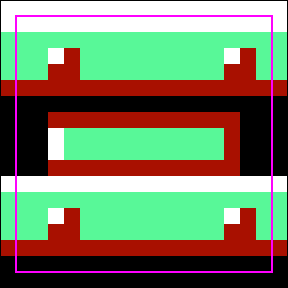
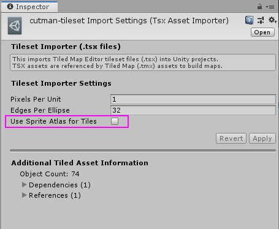

# Normal Maps with SuperTiled2Unity

Using normal maps with Tiled maps in Unity with prefabs created by SuperTiled2Unity can be achieved but introduces some complexity in the way your textures and tilesets are managed. This respository should serve as a guide on how to get started.

>**Important**: This will limit each layer in your Tiled maps to use tiles that belong to the same tileset. If you have `water` and `ground` tilesets, for example, then you'll want to use them in `water` and `ground` layers in Tiled.

There are 7 steps in this example:

1. Prepare your tileset texture sheets with "margins" around each tile. This will protect against seams that are common with the `TilemapRenderer` when sprite atlases are not used.
2.  Create a shader that renders sprites with a normal map. See `Assets/ExampleFiles/shaSpriteDiffuseNormal.shader` for an example.
3.  Create normal maps for your tilesets. The texture coordinates in the regular (diffuse) sprite texture must match the texture coordiantes of the normal map texture.
4.  Create a material for each tileset that uses your custom shader, tileset diffuse texture, and tileset normal map.
5.  Disable `Use Sprite Atlas for Tiles` for your Tiled tilesets.
6.  Hook up `Material Matchings` in your `SuperTiled2Unity Project Settings` (in Unity) so that each layer in your map is assigned the specific custom materials you've created.
7.  Reimport your Tiled Map in your Unity project.

Preparing Tileset Texture Sheets
--------------------------------
Normal mapping means we can't use texture or sprite atlasing which is too bad because atlasing pads your textures in a way that prevents seams. Without padding your tiles you will end up with something that looks like this ...

 Seaming is common with tilemapping in 3D engines because texture sampling often "picks" a texel that is just barely out of bounds of your tile bounds when rendering your scene.

In the tile above a texture sampler will, under some conditions, render one of neighboring gray pixels that lay just outside of the tile. This is resolved by padding each tile with extra (matching) pixels along the top, right, bottom, and left edge of the tile in the tilesheet.

In the above image the tile is padded with extra pixels around the tile boundary. Now if the texture sampler picks a texel *just barely* off to the side or top or bottom we'll be okay. This padding is performed automatically for us by the Unity texture atlases (and by SuperTiled2Unity) but here we're forced to do it by hand.

For reference here is the tileset texture used in this working example ...

... note that each tile is padded *and* there is a one-pixel gap between each tile. That gap isn't necessary but it does make the tileset easier on the eyes.

Tiled needs to know about these paddings and gaps, however. Here are the settings for our working tileset found at `Assets/ExampleFiles/Tiled/cutman-tileset.tsx`

Each tile is drawn as 18x18 pixels but we want them to be treated as 16x16 pixel tiles (hence the `Margin` setting of `1`). Each tile in the tilesheet has 3 pixels between them (2 for left/right or top/bottom padding and 1 for the gap) hence the `Spacing` setting of `3`.

Normal Map Shader
-----------------

Unity does not come with a stock shader that fits our needs but the Unity community has plenty of examples. Basically, you want a sprite shader that supports a normal map. I found a helpful example [on 6502B's blog](http://www.6502b.com/article.aspx?id=67) that I modified slightly for this example (see `Assets/ExampleFiles/shaSpriteDiffuseNormal.shader`).

 Creating Normal Maps
 --------------------

 For this example I simply converted my source tilesheet texture to grayscale and imported into Unity as a normal map but in real-life you'll want an artist to touch this up.
 
 

 Keep in mind the location and size these normal mapped tiles must match those found in your source tilesheet.

Creating Materials
------------------

Each tileset will need a custom material that matches the sprite texture with the normal map.

Disable Sprite Atlasing
------------------------
SuperTiled2Unity uses sprite atlases by default as without them you are likely to have seams in your game. We won't be able to use sprite atlases with normal maps however so they must be turned off for each tileset (`*.tsx` file) in your Unity project.

Hook Up Material Matching
-------------------------
In the SuperTiled2Unity project settings you have the ability to set up a custom material for each Tiled layer in your `*.tmx` file.

>Note: Material Matching is new with SuperTiled2Unity 1.8.0. You can find the latest SuperTiled2Unity builds on my [Itch.io](https://seanba.itch.io/supertiled2unity) page.

With this setup, any time a Tiled map is imported and finds a Tiled Layer named `BG-Cutman` it will use the `matCutmanTiles` material with the `TilemapRenderer` for that layer.

Working Example
---------------
Open the `Assets/ExampleFiles/SampleScene.unity` scene in Unity and press play. You should see a number of colored lights moving about a simple Tiled map with normal mapping applied.

Thanks a good luck with your game.
-Sean Barton

